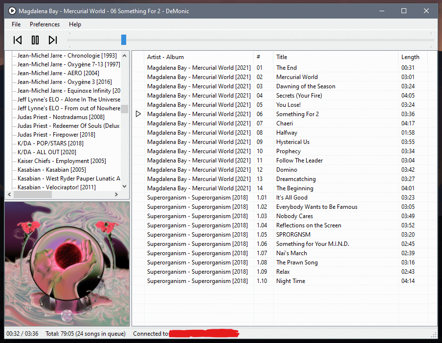

# DeMonic

A Subsonic music client for Windows 10.

## Goals

* Run natively (well, as native as .NET framework gets), therefore _fast_ and _lightweight_,
* Looks like my [personal Foobar2000 setup](https://www.tombofry.co.uk/uploads/2018-08-05_foobar2000.jpg),
* Scrobbles (using Subsonic),
* Has built-in Discord Rich Presence (because apparently I find it
  important to let everyone know what music I'm listening to at any
  given moment).

## Screenshot

